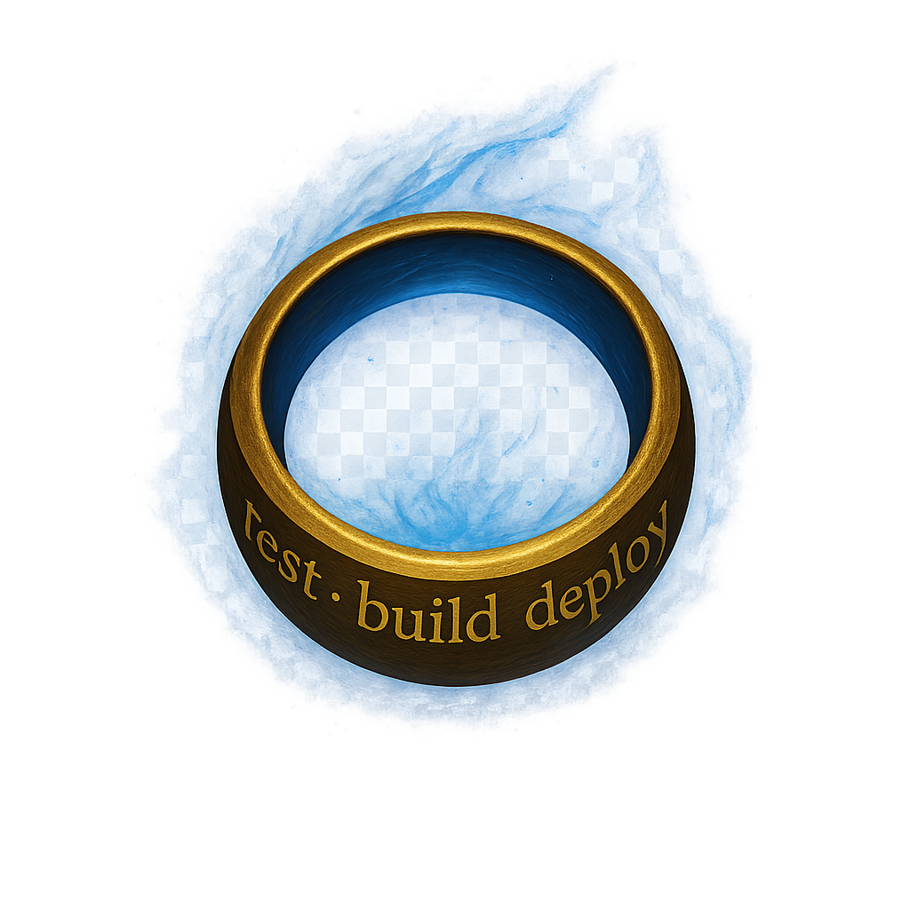
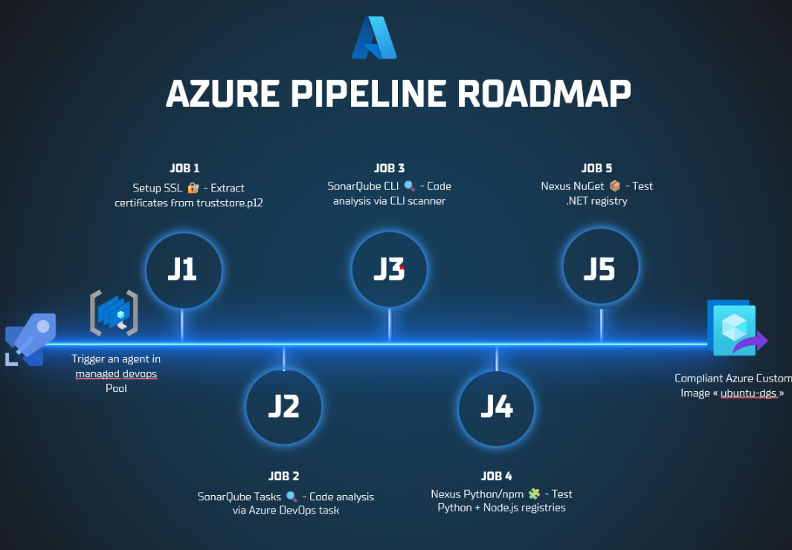
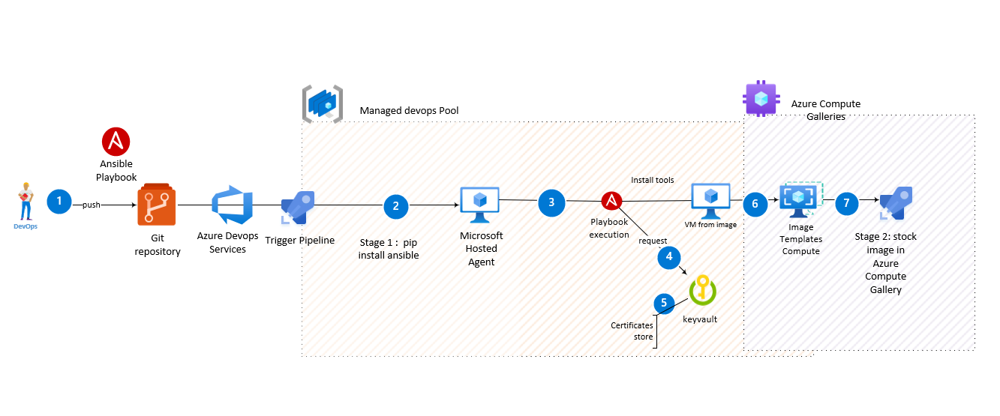

<div align="center">



### *One Image to rule them all*

[](https://dev.azure.com)
[](https://ubuntu.com)
[](LICENSE)

</div>


## Pipeline Roadmap

<div align="center">



</div>

### Stage 1: Environment Setup

Validates tool installation on the custom image.

**Job: Setup Tools**
- Loads environment variables for SSL and Java
- Executes Ansible playbook to verify tool versions
- Checks .NET SDK, Python, Maven, Docker, Node.js, SonarQube Scanner

### Stage 2: Code Quality Analysis

Tests SonarQube integration.

**Job 1: Azure DevOps Tasks**
- Uses native SonarQube extension
- Creates sample .NET project and runs analysis

**Job 2: CLI Scanner**
- Uses dotnet-sonarscanner command-line tool
- Alternative workflow for CLI-based pipelines

### Stage 3: Package Repository Connectivity

Validates Nexus Repository Manager access.

**Job 1: npm - lodash**
- Downloads JavaScript package from Nexus npm proxy

**Job 2: NuGet Pull - Newtonsoft.Json**
- Downloads .NET package from Nexus NuGet feed

**Job 3: NuGet Push**
- Creates and publishes test package to Nexus hosted repository

**Job 4: Maven**
- Resolves Java dependencies from Nexus Maven proxy

---

## Architecture Overview

<div align="center">



*Custom Ubuntu image validation pipeline for Azure DevOps Managed Pools*

</div>

---

## Configuration

Update `azure-pipelines.yml` with your environment:
```yaml
pool:
  name: your-build-agent-pool
  demands:
    - ImageOverride -equals your-custom-ubuntu-image

variables:
  - name: SONARQUBE_URL
    value: https://sonarqube.yourcompany.com
  - name: NEXUS_URL
    value: https://nexus.yourcompany.com
  - name: SONARQUBE_TOKEN
    value: $(SONARQUBE_TOKEN_SECRET)
```

### Prerequisites

- Azure DevOps organization with Managed DevOps Pool
- Custom Ubuntu image deployed to the pool
- Service connections: SonarQube, Nexus npm, Nexus NuGet (read + write)
- Secret variable: SONARQUBE_TOKEN_SECRET
- Optional: Secure File `truststore.p12` for enterprise SSL

---

## Validated Tools

| Tool              | Version     |
|-------------------|-------------|
| .NET SDK          | 8.0.414     |
| Python            | 3.10.12     |
| Maven             | 3.6.3       |
| Docker            | 28.4.0      |
| Node.js           | 22.20.0     |
| Java (OpenJDK)    | 17.0.16     |
| SonarQube Scanner | 7.2.0.5079  |
| Azure CLI         | 2.77.0      |

---

## Project Structure
```
.
├── azure-pipelines.yml          # Main pipeline definition
├── logo.png                     # Project logo
├── Azure_Pipeline.png           # Architecture diagram
├── photo.png                    # Pipeline roadmap
├── README.md                    # Documentation
└── templates/
    ├── setup-ssl.yml            # SSL certificate management
    └── setup-tools.yml          # Ansible tool validation playbook
```

---

## Troubleshooting

**SonarQube validation fails**
- Verify service connection credentials in Azure DevOps
- Check SONARQUBE_TOKEN secret variable is set
- Ensure SSL certificates include SonarQube server CA

**Nexus connectivity fails**
- Verify service connections have correct credentials
- Check network connectivity from build agents to Nexus
- Ensure Nexus repositories have proper read/write permissions

**SSL certificate errors**
- Verify truststore.p12 is uploaded to Secure Files
- Check certificate password (default: changeit)
- Ensure NODE_EXTRA_CA_CERTS environment variable is set

---

## License

This project is provided as-is for Azure DevOps environments.
